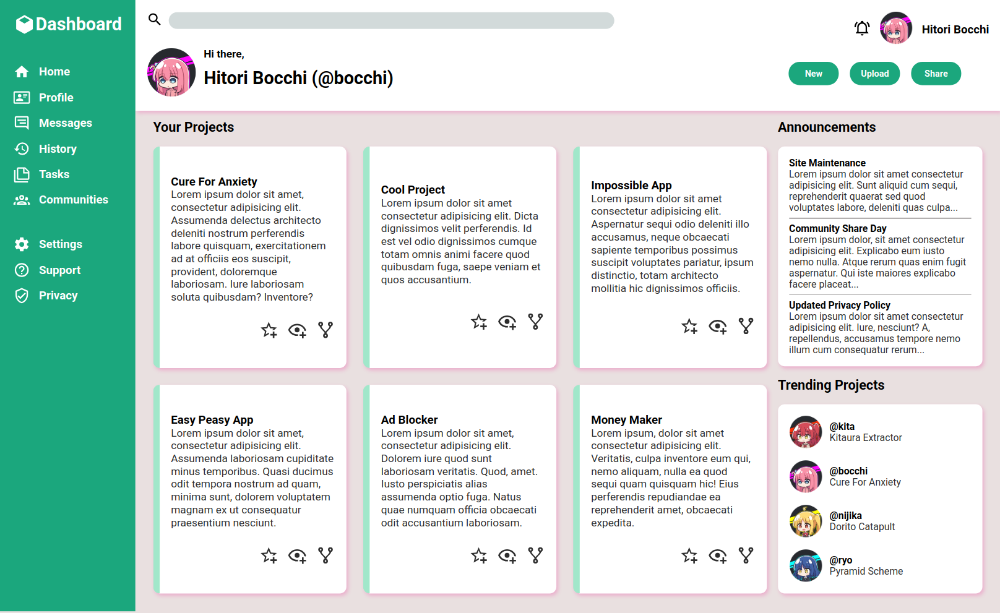

# Odin-Admin-Dashboard
This is an admin dashboard! It features a light design and examples of potential profiles and projects one may encounter in a similar dashboard.

**Link to project:** https://yoursm.github.io/odin-admin-dashboard/

## How It's Made:
**Tech used:** HTML, CSS

This project mainly focuses on the usage of CSS Grid. I wanted to really experiment with how web-pages can be laid out with the tool, and thus
the majority of the organization is done through it, with a little help from Flexbox in some areas.

The website is currently not responsive, however, the cards in the project section do expand and shrink when the window is resized through CSS Grid.

As for the icons and profiles, the prior are done by inlining SVGs, while the latter are images placed before spans and placed in their respective grids.

## Lessons Learned:
This was a very successful adventure into CSS Grid and one I am thrilled to have taken!

Upon finishing this project, I better understand the way grids implicitly create rows and columns as well as how to use them to my advantage in creating a layout, for example.
I also learned how to work with SVGs and the process of design, among many more aspects too abundant to list.

Through the many times I have tried something and it didn't quite work the way I expected it to, not to mention the countless times I had spaces where I didn't anticipate them,
I have greatly expanded my knowledge of Grid and HTML and CSS as a whole.